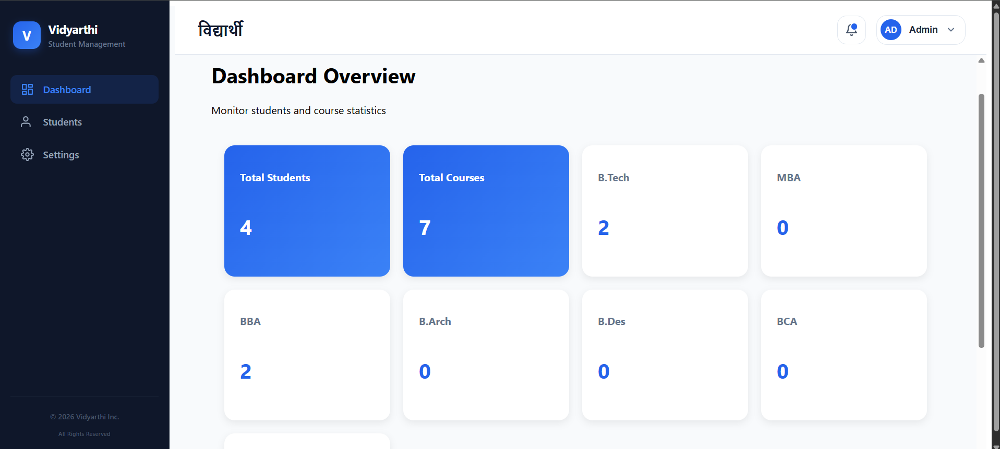
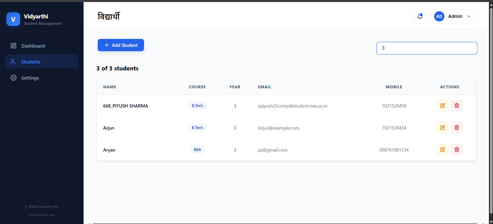
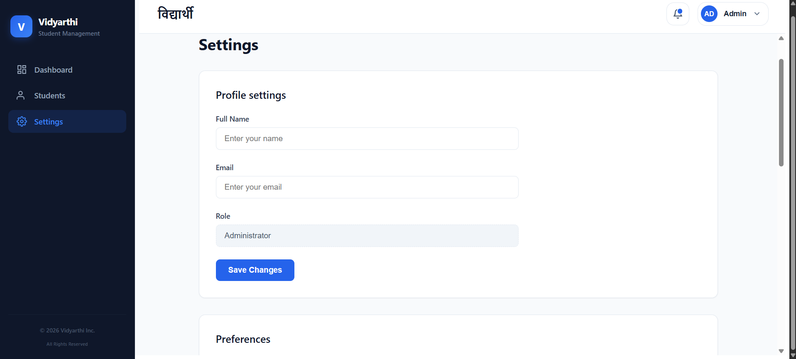
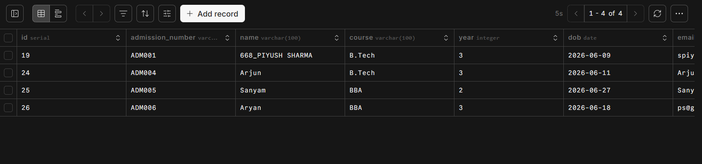

# Vidyarthi – Student Management System

A full-stack Student Management System built using React, Node.js, Express, and PostgreSQL. The application provides a centralized platform for managing student records, including student details, profile images, enrollment information, and academic data.

## Highlights

* Full-stack CRUD application
* PostgreSQL database integration
* CSV export functionality
* Search and filtering
* Dashboard analytics
* Cloud deployment using Vercel, Render, and Neon

## Live Demo

🔗 [View Live Application](https://student-management-system-three-ochre.vercel.app/)

---

## Features

### Student Management

* Add new students
* View all students
* Update student information
* Delete student records
* Search students by name
* Filter students dynamically

### Dashboard Analytics

* Total Students count
* Courses Offered count
* Real-time analytics from database

### Data Management

* Export student data to CSV
* Download student records for external use

### Settings

* Profile management
* Theme preferences
* Language preferences
* Data export tools

### Profile Image Upload

* Upload student profile photos
* File size validation (max 25 MB)
* Multer-based multipart form handling
* Base64 image storage support

### User Interface

* Fixed sidebar navigation
* Modal-based Add/Edit Student form
* Toast notifications
* Dynamic course badges
* Modern UI using CSS Modules
* Skeleton loading screens

### Database Operations

* PostgreSQL integration
* RESTful API architecture
* Persistent student record storage

---

## Tech Stack

### Frontend

* React (Vite)
* React Router DOM
* Axios
* CSS Modules
* React Hot Toast

### Backend

* Node.js
* Express.js
* Multer

### Database

* PostgreSQL

---

## Deployment

### Frontend
* Vercel

### Backend
* Render

### Database
* Neon PostgreSQL

---

## Project Structure

```text
student-management-system/
│
├── backend/
│   ├── db.js
│   ├── server.js
│   └── package.json
│
├── frontend/
│   └── studentManagementSystem/
│       ├── public/
│       ├── src/
│       │   ├── assets/
│       │   ├── Components/
│       │   │   ├── Loader/
│       │   │   ├── Dashboard.jsx
│       │   │   ├── Layout.jsx
│       │   │   ├── Settings.jsx
│       │   │   ├── StudentForm.jsx
│       │   │   └── StudentTable.jsx
│       │   │
│       │   ├── Services/
│       │   │   └── api.js
│       │   │
│       │   ├── Store/
│       │   │   └── Student-management-store.jsx
│       │   │
│       │   ├── App.jsx
│       │   └── main.jsx
│       │
│       ├── package.json
│       └── vercel.json
│
├── Screenshots/
│
└── README.md
```

---

## Installation & Setup

### 1. Clone Repository

```bash
git clone https://github.com/Ctrl-Piyush07/student-management-system.git
```

### 2. Backend Setup

```bash
cd backend
npm install
npm start
```

Backend runs on:

```text
http://localhost:5000
```

### 3. Frontend Setup

```bash
cd frontend/studentManagementSystem
npm install
npm run dev
```

Frontend runs on:

```text
http://localhost:5173
```

---


## API Endpoints

### Get All Students

```http
GET /students
```

### Get Student By ID

```http
GET /students/:id
```

### Create Student

```http
POST /students
```

### Update Student

```http
PUT /students/:id
```

### Delete Student

```http
DELETE /students/:id
```

---

## Screenshots

### Dashboard



---

### Students List


---

### Search & Filtering



---

### Add Student Form


---

### Edit Student Form


---

### Settings Page



---

### Notifications


---

### Neon PostgreSQL Database



---

## Future Improvements

* CSV Import functionality
* Data visualization charts
* Authentication & Authorization
* Role-based access control
* Excel/PDF export support
* Advanced dashboard analytics
* Dark/Light theme switching
* Mobile-first responsive optimization
* Pagination

---

## Author

**Piyush Sharma**

GitHub: [Ctrl-Piyush07](https://github.com/Ctrl-Piyush07)

Project Repository: [student-management-system](https://github.com/Ctrl-Piyush07/student-management-system)
