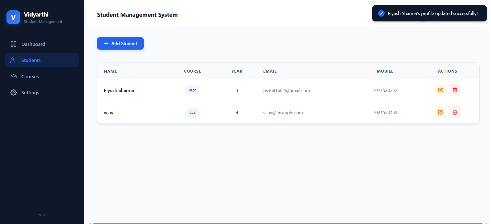
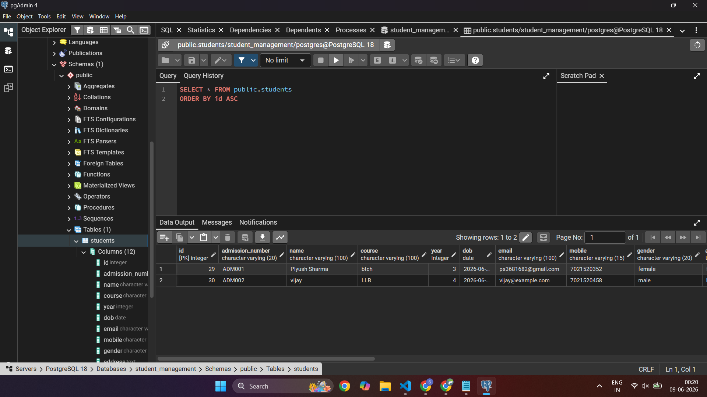

# Vidyarthi – Student Management System

A full-stack Student Management System built using React, Node.js, Express, and PostgreSQL. The application provides a centralized platform for managing student records, including student details, profile images, enrollment information, and academic data.

---

## Features

### Student Management

* Add new students
* View all students
* Update student information
* Delete student records

### Profile Image Upload

* Upload student profile photos
* File size validation (max 25 MB)
* Multer-based multipart form handling
* Base64 image storage support

### User Interface

* Responsive dashboard layout
* Fixed sidebar navigation
* Modal-based Add/Edit Student form
* Toast notifications
* Dynamic course badges
* Modern UI using CSS Modules

### Database Operations

* PostgreSQL integration
* RESTful API architecture
* Persistent student record storage

---

## Tech Stack

### Frontend

* React (Vite)
* React Router DOM
* Axios
* CSS Modules
* React Hot Toast

### Backend

* Node.js
* Express.js
* Multer

### Database

* PostgreSQL

---

## Project Structure

```text
student-management-system/
│
├── backend/
│   ├── db.js
│   ├── server.js
│   ├── package.json
│
├── frontend/
│   ├── src/
│   │   ├── Components/
│   │   ├── Services/
│   │   ├── App.jsx
│   │   └── main.jsx
│   │
│   ├── package.json
│
└── README.md
```

---

## Installation & Setup

### 1. Clone Repository

```bash
git clone https://github.com/Ctrl-Piyush07/student-management-system.git
```

### 2. Backend Setup

```bash
cd backend
npm install
npm start
```

Backend runs on:

```text
http://localhost:5000
```

### 3. Frontend Setup

```bash
cd frontend/studentManagementSys
npm install
npm run dev
```

Frontend runs on:

```text
http://localhost:5173
```

---


## API Endpoints

### Get All Students

```http
GET /students
```

### Get Student By ID

```http
GET /students/:id
```

### Create Student

```http
POST /students
```

### Update Student

```http
PUT /students/:id
```

### Delete Student

```http
DELETE /students/:id
```

---

## Screenshots

### Students List


---

### Add Student Form


---

### Edit Student Form


---

### Notifications



---

### Database



---

## Future Improvements

* Search and filtering
* Pagination
* Authentication & Authorization
* Role-based access control
* Export data to Excel/PDF
* Dashboard analytics
* Responsive layout

---

## Author

**Piyush Sharma**

GitHub: https://github.com/Ctrl-Piyush07
